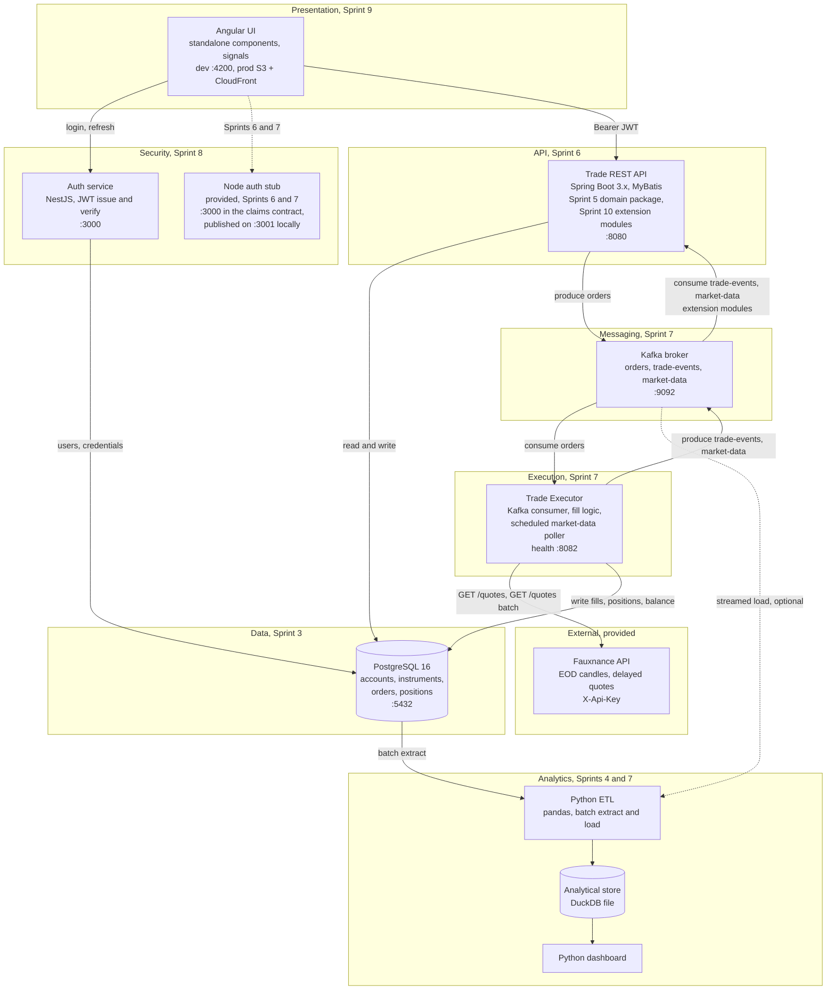

# Architecture

Status: canonical. This document defines the shape of the Enterprise Trading Platform. Week briefs, starter code and contracts must agree with it. Where a source document disagrees, see `DECISIONS.md`. The restructure this file now describes, and the reasoning behind each part of it, is recorded in `TARGET_ARCHITECTURE.md`. The same structure is drawn service by service in [`diagrams/index.html`](diagrams/index.html).

## Why the platform is shaped this way

A trading platform has to do three things that a CRUD application does not. It must record an intent to trade before that trade has happened, because execution is asynchronous and can fail. It must keep an audit trail that survives every restart and every bad deployment, because the record is the legal position. It must separate the store that answers "what is my balance right now" from the store that answers "what did the desk trade last quarter", because those two questions have incompatible access patterns.

Every architectural choice below follows from one of those three. Participants build the platform in that order: the record first, then the analytics view, then the domain rules, then the service that exposes them, then the eventing that makes execution asynchronous, then identity, then the interface.

## Layered view



## Services

| Service | Sprint | Technology | Port | Responsibility |
|---|---|---|---|---|
| Angular UI | 9 | Angular 21+, TypeScript, signals, RxJS | 4200 in development, static objects behind CloudFront in production | Login, dashboard, order ticket, blotter. Holds the JWT, attaches it through an interceptor, guards authenticated routes. Consumes typed clients generated from the contracts in `contracts/`. |
| Auth service | 8 | NestJS 11, TypeScript, argon2 or bcrypt, Jest | 3000 | Registration, login, refresh, current user. Signs and verifies JWTs. Owns the credential store. It is the only service that ever sees a password. |
| Node auth stub | provided, used in 6 and 7 | Node, minimal HTTP server | 3000 in the claims contract, published on 3001 locally so it can run beside the real auth service | Issues test JWTs with identical claims to the real service so that Sprint 6 and Sprint 7 work can be authenticated before Node is taught. Discarded in Sprint 8. |
| Trade REST API | 6, extended in 10 | Spring Boot 3.x, MyBatis 3.5, Bean Validation, Docker | 8080 | The write path. Validates orders against the business rules, persists them, publishes them to `orders`. Serves account details, balance, positions and order history. Verifies the JWT on every `/api/**` route. Holds the Sprint 5 domain model as a source package, and every Sprint 10 extension as a further package with its own routes and its own Kafka consumers. |
| Kafka broker | 7 | Apache Kafka 3.x or 4.x | 9092 externally, 29092 inside the compose network | Carries `orders`, `trade-events` and `market-data`. The team creates the topics and configures every producer and consumer. See `contracts/kafka-topics.md`. |
| Trade Executor | 7 | Java 21, Kafka consumer and producer | health endpoint on 8082 | Consumes `orders`, prices the order against a live Fauxnance quote, decides fill or reject, writes the fill, updates cash and position atomically, publishes the lifecycle event to `trade-events`. Also runs the market-data poller on a schedule, calling the Fauxnance batch quotes endpoint for held and watched symbols and publishing one message per symbol to `market-data`. Students build this; no broker simulator is provided. |
| PostgreSQL | 3 | PostgreSQL 16 or 17 | 5432 | The system of record. Accounts, instruments, orders, positions. Also holds the auth service's user table, in its own schema. |
| Python ETL and dashboard | 4 and 7 | Python 3.12+, pandas, matplotlib or plotly, pytest | none | Batch extract from Postgres, transform, load into the analytical store. Dashboard reads the analytical store from Sprint 7 onwards, and Postgres directly before that. |
| Analytical store | 4 and 7 | DuckDB | none | Star schema over trades, held in one file on disk. See `contracts/analytics-schema.sql`. |
| Fauxnance API | provided | Managed HTTP service | `https://y4t9nq2bqf.execute-api.eu-west-2.amazonaws.com/v1` | EOD candles and delayed quotes. Authenticated with a per-student `X-Api-Key`, 2000 requests per day. Swagger at `/v1/docs`. |

SonarQube is a quality gate run against the code, not a component of the platform, so it does not appear in the table. Its place in Sprint 7 is unchanged: it gates the Java services and the Python pipeline, self-hosted on port 9000 or run against a hosted instance.

## Order placement, end to end

This is the path every participant must be able to describe from memory by the end of Sprint 7.

```mermaid
sequenceDiagram
  participant U as Angular UI
  participant A as Auth service
  participant T as Trade REST API
  participant P as PostgreSQL
  participant K as Kafka
  participant X as Trade Executor
  participant F as Fauxnance API
  participant E as Analytics service

  U->>A: POST /auth/login
  A-->>U: accessToken, refreshToken
  U->>T: POST /api/v1/orders + Bearer token
  T->>T: verify the JWT signature locally
  T->>P: SELECT account, instrument, position
  T->>T: validate against business rules 1 to 5 in the domain package
  T->>P: INSERT order status NEW, unique idempotencyKey
  T->>K: produce to orders, key accountId
  T-->>U: 200 orderId, status NEW
  K->>X: consume orders, group trade-executor
  X->>F: GET /quotes/{symbol}
  F-->>X: price, asOf, marketState
  X->>X: apply fill rules against the quoted price
  X->>P: BEGIN; update order to FILLED or REJECTED; debit or credit cash; upsert position; COMMIT
  X->>K: produce to trade-events, key accountId
  K->>T: consume trade-events, extension modules
  P->>E: batch extract
  E->>E: load FACT_TRADES in DuckDB
  U->>T: GET /api/v1/accounts/{id}/orders
  T-->>U: updated blotter
```

Points that matter, and are commonly got wrong:

- The HTTP response returns before the fill happens. From Sprint 7 onwards `POST /api/v1/orders` returns `status: NEW`. In Sprint 6, before the executor exists, the same endpoint fills synchronously and returns `FILLED` or `REJECTED`. The contract permits both; the behaviour changes in Sprint 7 and the UI must handle it.
- The cash debit and the position update belong to the executor, in one transaction, not to the API. The API only validates and records intent.
- Idempotency is enforced by a unique constraint on `orders.idempotency_key`, not by an application-level check. A duplicate key is a `409 ORD-409`.
- The executor is a consumer group. Two instances of it must not double-fill the same order. Keying by `accountId` and enforcing the order status transition inside the database transaction is what makes that safe.
- Rejections are events too. A rejected order publishes to `trade-events` with `eventType: ORDER_REJECTED`, so notifications and analytics see it.
- The domain call is in-process, which is why it appears as the API calling itself rather than as a separate participant. The layering rule is unchanged by that: no SQL in a controller, no HTTP type in the domain package, and no Spring annotation in the domain package beyond validation. Review enforces it, rather than a Maven boundary.

## Operational and analytical split

| Concern | Operational | Analytical |
|---|---|---|
| Store | PostgreSQL | DuckDB, one file on disk |
| Model | Normalised to third normal form, per `contracts/database-schema.sql` | Star schema, per `contracts/analytics-schema.sql` |
| Written by | Trade REST API, Trade Executor, Auth service | Python ETL only |
| Read by | All services, the UI through the APIs | Dashboard, notebooks, extension analytics |
| Latency | Milliseconds, single row | Seconds, full scan and aggregate |
| Retention | Current state plus full order history | Append-only history, dimensions with effective dates |
| Failure impact | Trading stops | Reporting is stale |

Never point the dashboard at the operational database after Sprint 7. The point of the split is that an analyst running a five-minute aggregate must not be able to slow down order placement. Sprint 4 reads Postgres directly because the analytical store does not exist yet; Sprint 7 moves it.

The load runs both ways in the platform but for different reasons. Batch ETL extracts from Postgres on a schedule and is the source of truth for `FACT_TRADES`. Streaming consumption of `trade-events` is optional and, where teams build it, must reconcile against the batch load rather than replace it.

## Where each sprint's component sits

| Sprint | Component | Layer | Depends on | Provides to |
|---|---|---|---|---|
| 3 | Trade database | Data | nothing | everything |
| 4 | Analytics and first ETL | Analytics | Sprint 3 schema | dashboard, later the analytical store |
| 5 | Trading domain package | Domain | Sprint 3 model | Sprint 6 service, which absorbs it as source |
| 6 | Trade REST API, holding the Sprint 5 domain package | API | Sprint 5 package, Sprint 3 schema, provided auth stub | UI, Kafka, the Sprint 10 extension modules |
| 7 | Kafka topics, Trade Executor and the poller inside it, batch ETL | Messaging, Execution, Analytics | Sprint 6 API, Fauxnance | analytics, extension modules, notifications |
| 8 | Auth service | Security | Sprint 3 schema, Sprint 6 API to protect | UI, every API |
| 9 | Angular UI | Presentation | Sprints 6 and 8 contracts | end users |
| 10 | Extension modules inside the Trade REST API | API | all core components | the team's distinctive capability |
| 11 | S3 and CloudFront deployment | Delivery | Sprint 9 build | a reachable system |

## Security boundaries

| Boundary | Control | Sprint introduced |
|---|---|---|
| Browser to any service | HTTPS in deployed environments, TLS 1.2 minimum | 11 |
| UI to Auth service | Credentials over HTTPS only, argon2 or bcrypt at rest, no password ever logged | 8 |
| UI to Trade REST API | Signed JWT in the `Authorization: Bearer` header, verified on every `/api/**` route | 6 with the stub, 8 with the real service |
| Trade REST API to Postgres | Parameterised statements through MyBatis, a least-privilege application role, no DDL rights | 3 and 6 |
| Any service to Kafka | Local development runs plaintext. Document the TLS, SASL and ACL configuration you would apply in production; do not claim it is implemented if it is not. | 7 |
| Any service to Fauxnance | `X-Api-Key` from an environment variable. Never commit a key. Never send a key to the browser. | 7 |
| Deployed UI to S3 | Private bucket, origin access control, reachable only through CloudFront | 11 |

The Fauxnance key rule has a direct consequence for the architecture: the Angular UI must never call Fauxnance directly. Prices reach the browser through the Trade REST API, including its extension modules, or through a `market-data` consumer, never from client-side JavaScript holding a key. The Trade Executor is the only platform service that calls Fauxnance for quotes, which is what keeps the quote key in one place.

## Local topology

Development runs under Docker Compose: Postgres, Kafka, the Trade REST API with its domain package and its extension modules, the auth service or stub, and the Trade Executor, which runs the market-data poller on its own schedule. Six containers, and nothing listens on 8081 or 8083. The Angular dev server and the Python tooling run on the host. Nothing in the platform requires cloud infrastructure before Sprint 11, and Sprint 11 deploys only the Angular build.
