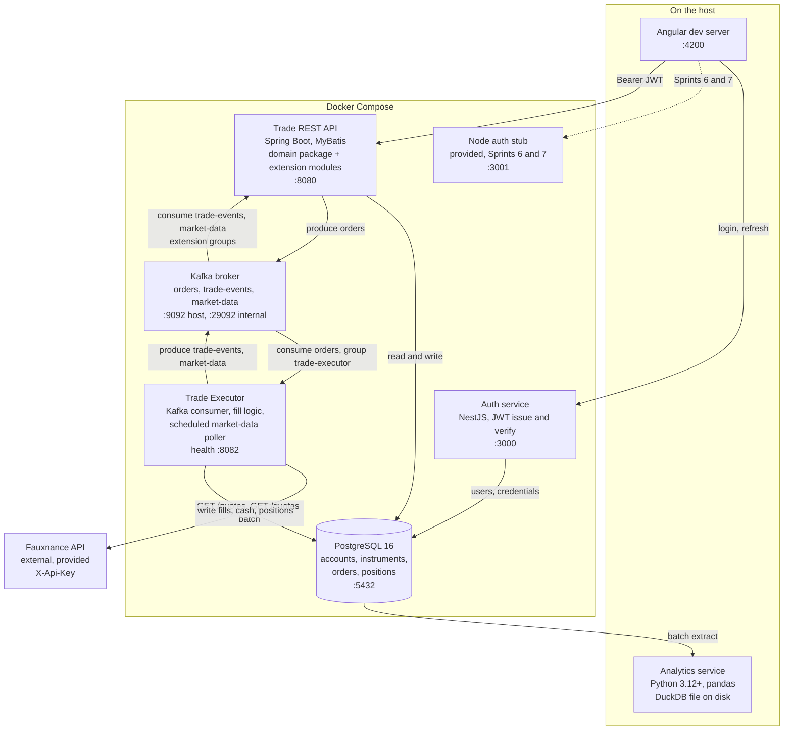

# Target architecture

Status: the specification for the restructure, and the record of it. This document defines the shape the Enterprise Trading Platform was restructured to. It governs the parts of `ARCHITECTURE.md` it names below: the Services table, both diagrams, the operational and analytical split, and the sprint-to-component table. Everything in `ARCHITECTURE.md` that it does not name still stands.

The documentation work is complete. Every edit listed under "Documents this changed" has been made, on `reference` and on both student branches. The reference implementation has not yet been rebuilt: the code under `services/`, `extensions/` and `analytics/` still has the shape the restructure replaces. That rebuild is a separate piece of work, listed as out of scope at the end.

## Why the platform is being reshaped

The platform as specified has eight or more deployable units by Sprint 10: the Trade REST API, the Trade Executor, the market-data poller, the auth service, the auth stub, the Angular build, one to six extension services, and the Python pipeline. Every one of those beyond the first five costs a team the same fixed tax: a Dockerfile, a compose entry, a port, a set of environment variables, a JWT verification path, and a second afternoon spent working out why the container cannot reach Postgres. None of that tax teaches the domain. It teaches deployment, which is Sprint 11's job and is taught there against a single artefact.

The target is five services and a broker the team stands up and owns. The integration lesson does not weaken, because the five remaining services still speak over HTTP, over Kafka and through a shared database, and the JWT still has to cross every boundary. What goes away is the repeated wiring of a sixth, seventh and eighth container that each carry one feature.

Two further changes follow the same reasoning. One language per service, so the poller stops being a Python container inside a Java execution path. One analytical store named plainly, so nobody spends a morning deciding whether they need a Snowflake account.

## The six things graduates build

| Service | Sprint | Technology | Port | Responsibility |
|---|---|---|---|---|
| Trade REST API | 6, extended in 10 | Java 21, Spring Boot 3.x, MyBatis 3.5, Bean Validation, Docker | 8080 | The write path. Validates orders against the business rules, persists them, publishes them to `orders`. Serves account details, balance, positions and order history. Verifies the JWT on every `/api/**` route. Hosts the Sprint 5 domain model as a source package, and every Sprint 10 extension as a further package with its own routes and its own Kafka consumers. |
| Trade Executor | 7 | Java 21, Kafka consumer and producer, Docker | health endpoint on 8082 | Consumes `orders`, prices each order against a live Fauxnance quote, decides fill or reject, writes the fill and updates cash and position in one transaction, publishes the lifecycle event to `trade-events`. Also runs the market-data poller on a schedule, calling the Fauxnance batch quotes endpoint for held and watched symbols and publishing one message per symbol to `market-data`. |
| Auth service | 8 | NestJS 11, TypeScript, argon2 or bcrypt, Jest | 3000 | Registration, login, refresh, current user. Signs and verifies JWTs. Owns the credential store. It is the only service that ever sees a password. |
| Angular UI | 9 | Angular, TypeScript, standalone components, signals, RxJS, Playwright | 4200 in development, static objects behind CloudFront in production | Login, dashboard, order ticket, blotter, and the views for the team's extensions. Holds the JWT, attaches it through an interceptor, guards authenticated routes. Consumes typed clients generated from the contracts in `contracts/`. |
| Analytics service | 4, extended in 7 | Python 3.12+, pandas, DuckDB, matplotlib or plotly, pytest | none | Batch extract from Postgres, transform, load into a DuckDB star schema per `contracts/analytics-schema.sql`. Serves the dashboard from that store from Sprint 7 onwards, and from Postgres directly before it exists. |
| Kafka event backbone | 7 | Apache Kafka 3.x or 4.x | 9092 externally, 29092 inside the compose network | Carries `orders`, `trade-events`, `market-data` and their dead-letter topics. The team creates the topics, chooses and justifies partition counts and keys against `contracts/kafka-topics.md`, and configures every producer and consumer. |

Supporting infrastructure, provided and not built by anyone:

| Component | Provided as | Port | Note |
|---|---|---|---|
| PostgreSQL | Docker Compose service, image `postgres:16` | 5432 | The system of record. Accounts, instruments, orders, positions, and the auth service's user table in its own schema. Teams write the schema in Sprint 3; the container is provided. |
| Fauxnance API | Deployed HTTP service | `https://y4t9nq2bqf.execute-api.eu-west-2.amazonaws.com/v1` | End-of-day candles and delayed quotes, per-student `X-Api-Key`, 2000 requests per day. |
| Node auth stub | Docker Compose service, source shipped in `services/auth-stub` | 3000 in the claims contract, published on 3001 locally so it can run beside the auth service | A fixture for Sprints 6 and 7 with the same claims as the real service. Discarded in Sprint 8. No assessment attached. |

SonarQube is a quality gate run against the code, not a component of the platform, so it appears in neither table. Its place in Sprint 7 is unchanged.

## What changed and why

### The market-data poller moves into the Trade Executor and is written in Java

Before the restructure the poller was a standalone Python service at `services/market-data-poller`, with its own Dockerfile, its own compose entry and a health endpoint on 8083. No decision in `DECISIONS.md` ever chose Python for it. `ARCHITECTURE.md` listed it that way and everything downstream followed.

In the target it is a scheduled component inside the Trade Executor, written in Java alongside the consumer it sits next to. Two things follow. The platform loses a deployable, with all of its wiring. Python is left owning exactly one thing, the analytics service, which makes the language boundary in the platform a boundary that means something: Python is where the analytical estate lives, and nowhere else. One language per service, and no container running two runtimes.

The poller's job does not change. It calls `GET /quotes?symbols=...` on an interval for the symbols the platform holds and watches, up to 25 per call, and publishes one message per symbol to `market-data`. Batching is a quota optimisation and must not become a batched Kafka message, because that would break per-symbol keying. The 2000-request daily quota still constrains the design and is still meant to: a team that polls every symbol every second exhausts its key before lunch, and finding that out is part of the sprint.

Placing the poller beside the executor also removes an argument teams currently have about which service holds the Fauxnance key. One service calls Fauxnance. One service holds the key.

### Extensions become modules inside the Trade REST API

The six catalogue extensions (Portfolio and P&L, Watchlists and price alerts, Customer notifications, Customer preferences, Trade advice and signals, Automated strategy execution) were specified as separate microservices on 8081 and 8084 upwards. In the target they are packages inside the Trade REST API, each with its own routes, its own service layer and, where it needs one, its own Kafka consumer with its own group id.

The reasoning is about where a graduate team's final sprint goes. Sprint 10 is one applied week. A team standing up a sixth deployable spends the first two days on a Dockerfile, a port allocation, a compose entry and a second copy of JWT verification, and demonstrates the feature on Friday morning if at all. The same team writing a package inside a service that already boots, already verifies tokens and already has a database connection starts on the feature on Monday afternoon. The integration lesson the separate service was supposed to teach is already taught, five times over, by the five real services and the broker between them.

Two consequences are worth stating so that nobody has to infer them. `contracts/portfolio-api.yaml` still governs the portfolio routes exactly as written; they are now served by the Trade REST API on 8080 rather than by a portfolio service on 8081. And each extension keeps a distinct Kafka consumer group id, `portfolio-service`, `notification-service` and so on, because a group id names a logical consumer and separate ids keep each module's offsets independent, even though they now run in one process.

Authorisation gets harder, not easier, and that is worth the trouble. In a separate service a team could rely on the service boundary. In a shared service every extension route has to enforce its own authorisation, and a route that returns another customer's portfolio is now a bug inside the same application that holds the order book. The Sprint 10 security review has more to find, not less.

### The trading domain engine folds into the Trade REST API

`services/trading-engine` is currently a separate Maven artifact, and `services/trade-api/pom.xml` line 38 carries the instruction to run `mvn install` in `services/trading-engine` before building the API. That prerequisite breaks a clean checkout on a fresh machine and teaches nothing about the domain. The Trade Executor does not depend on the engine at all, so the artifact has exactly one consumer.

`ARCHITECTURE.md` line 93 already describes the engine as "packaged as a module inside the Trade REST API from Sprint 6 onwards". The target makes that literal. Sprint 5 builds the domain model as a plain Java package: entities, enumerations, DTOs, the exception hierarchy and the buy and sell rules, with no framework, no database and no HTTP. Sprint 6 absorbs that package into the Trade REST API as source. The separate artifact and the `mvn install` prerequisite both disappear.

Sprint 5 keeps its own folder, its own brief and its own assessment. The constraint that made it valuable, no Spring dependency and no I/O in the domain, is unchanged and is still checked: it is now a rule about what may appear inside a package rather than a rule enforced by a module boundary, which is the form the constraint takes in most real codebases anyway. What changes is where the code ends up in Sprint 6, and that a checkout builds with one command.

### Snowflake is dropped and DuckDB is named as the analytical store

The reference analytics code has always run on DuckDB. `analytics/src/analytics/db/warehouse.py` opens a DuckDB file and applies the schema. Snowflake survived only in prose, where `ARCHITECTURE.md` and `DECISIONS.md` described it as the target with DuckDB as a stand-in or a fallback. That framing cost a team a decision it had no information to make and no reason to make, and it invited a Sprint 4 morning spent on account provisioning.

The analytical store is DuckDB. One file, no server, no account, no credentials. `contracts/analytics-schema.sql` is plain ANSI SQL and runs on it unchanged, which is the property that made the choice safe in the first place. Nothing in the analytics code changes; only the documents that describe it.

The lesson Sprint 4 and Sprint 7 are assessed on is the operational and analytical split: two stores, two models, two access patterns, and a dashboard that must never point at the trading database after Sprint 7. That lesson is carried by the star schema and by the separation, not by the vendor. A graduate who can explain why `FACT_TRADES` is loaded in batch from Postgres rather than read live can explain it on any warehouse.

### The graduates create the topics and own the Kafka configuration

`infra/kafka/create-topics.sh` was a complete, working, idempotent script shipped to students, and `docker-compose.yml` ran it through a `kafka-init` service on `docker compose up`, before any sprint work had begun. By the time a team reached Sprint 7, the three topics already existed with the right partition counts and the right retention, created by a file they did not write. The sprint then assessed them on producing to and consuming from topics somebody else configured.

Both are removed. Docker Compose still starts the Kafka container, because running a broker is not the lesson and a team that spends Sprint 7 on KRaft configuration has lost the week. Everything above that line is the team's work: creating the three topics and their dead-letter counterparts, choosing and justifying the partition counts and keys against `contracts/kafka-topics.md`, and configuring producers and consumers, including `acks`, idempotence, offset commit behaviour and explicit group ids.

`KAFKA_AUTO_CREATE_TOPICS_ENABLE` stays `false` in the compose file. Auto-creation produces a one-partition topic with default retention, which is wrong for all three topics, and it produces it silently on first use. Leaving it off means a team that has not created its topics gets an error rather than a subtly wrong platform, which is the failure they can act on.

The contract does not move. Topic names, keys, partition counts, retention and the message envelope in `contracts/kafka-topics.md` stay fixed and binding, and a team that renames a topic breaks every consumer in the platform including ones another team wrote. What is now the deliverable is how the topics come to exist and why they are shaped that way.

## Local topology



Docker Compose provides six containers and nothing else.

| Container | Profile | Port | Note |
|---|---|---|---|
| `postgres` | default | 5432 | Init scripts in `infra/postgres/` run once against an empty volume. |
| `kafka` | default | 9092 host, 29092 internal | Single broker, KRaft mode. Starts empty. The team creates the topics. |
| `trade-api` | `platform` | 8080 | Holds the domain package and every extension module. |
| `auth-service` | `platform` | 3000 | Sprint 8 onwards. |
| `auth-stub` | `platform` | 3001 | Sprints 6 and 7. Both auth containers can run at once. |
| `trade-executor` | `platform` | 8082, health only | Holds the poller. Reads `FAUXNANCE_API_KEY` and `POLL_INTERVAL_SECONDS`. |

Gone from the current file: `kafka-init`, `market-data-poller` and `portfolio-service`. Ports 8081 and 8083 are no longer allocated to anything. `docker compose up` with no profile still starts infrastructure only, which is what Sprint 3 and the first half of Sprint 7 work against.

The Angular dev server and the Python tooling run on the host, as they do today. Nothing in the platform requires cloud infrastructure before Sprint 11, and Sprint 11 deploys only the Angular build.

## Order placement, end to end

Every participant must be able to describe this path from memory by the end of Sprint 7. It is the same path as today with two fewer participants, because the domain engine now runs inside the Trade REST API and the poller runs inside the executor.

```mermaid
sequenceDiagram
  participant U as Angular UI
  participant A as Auth service
  participant T as Trade REST API
  participant P as PostgreSQL
  participant K as Kafka
  participant X as Trade Executor
  participant F as Fauxnance API
  participant E as Analytics service

  U->>A: POST /auth/login
  A-->>U: accessToken, refreshToken
  U->>T: POST /api/v1/orders + Bearer token
  T->>T: verify the JWT signature locally
  T->>P: SELECT account, instrument, position
  T->>T: validate against business rules 1 to 5 in the domain package
  T->>P: INSERT order status NEW, unique idempotencyKey
  T->>K: produce to orders, key accountId
  T-->>U: 200 orderId, status NEW
  K->>X: consume orders, group trade-executor
  X->>F: GET /quotes/{symbol}
  F-->>X: price, asOf, marketState
  X->>X: apply fill rules against the quoted price
  X->>P: BEGIN; update order to FILLED or REJECTED; debit or credit cash; upsert position; COMMIT
  X->>K: produce to trade-events, key accountId
  K->>T: consume trade-events, extension modules
  P->>E: batch extract
  E->>E: load FACT_TRADES in DuckDB
  U->>T: GET /api/v1/accounts/{id}/orders
  T-->>U: updated blotter
```

The points that were commonly got wrong are still the points that are commonly got wrong, and none of them changes here: the HTTP response returns before the fill happens, the cash debit and the position update belong to the executor in one transaction, idempotency is a unique constraint rather than an application check, the executor is a consumer group that must not double-fill, and a rejection is an event that gets published.

Two are new.

The domain call is now in-process. `T->>T` rather than a call to a separate participant. That does not make the layering optional: no SQL in a controller, no HTTP type in the domain package, and no Spring annotation in the domain package beyond validation. The rule is now enforced by review rather than by a Maven boundary.

The market-data flow does not appear in this diagram at all, because it is not part of order placement. The poller runs on its own schedule inside the executor and publishes to `market-data`, which the extension modules consume. A team that couples the poll interval to order placement has misread both.

## What the graduates own on Kafka

The team's Sprint 7 deliverable on the broker is everything except the broker process:

- The three topics from `contracts/kafka-topics.md`, created with the contracted names, partition counts, replication factor and retention, plus the three `<topic>.DLT` dead-letter topics.
- A written justification of the partition counts and the key choices, against the contract's reasoning rather than repeating it.
- Producer configuration: `acks=all`, `enable.idempotence=true`, bounded in-flight requests, and publishing after the database commit rather than inside the transaction.
- Consumer configuration: auto-commit disabled, offsets committed after processing, an explicit `group.id` per logical consumer, and an idempotent handler that survives seeing the same `eventId` twice.
- Dead-letter routing that distinguishes a malformed message, which never succeeds, from a transient failure, which succeeds on retry.

Support for that work differs by cohort. The difference is in what is supplied, not in what is assessed.

| Item | `us-ireland` | `india` |
|---|---|---|
| Topic creation script | An empty executable file at `sprint-07-event-backbone/scripts/create-topics.sh`, with a header comment naming its purpose and nothing else | No file. The team decides where the command lives and what runs it. |
| Brief | Guided: what a topic creation call has to carry (bootstrap address, topic name, partition count, replication factor, retention, cleanup policy), why auto-creation is switched off, and how to confirm the result with `--describe` | An engineering contract: the topics that must exist, their contracted properties, and the reasoning the team must record. No walkthrough of a command. |

How the topics were created is not assessed. What is assessed is that they exist with the contracted names and partition counts, and that messages produced to them carry the contracted keys. A team that types three `kafka-topics.sh` commands by hand and records them is held to the same standard as a team that writes a script.

The general policy behind the split is unchanged and is not reopened here. `us-ireland` runs twelve weeks with Sprints 3 to 11 and receives scaffolds, meaning build files, directory trees, configuration skeletons and empty files at named paths, together with guided briefs. It never receives method bodies or answers. `india` runs nine weeks with Sprints 3 to 10 plus an alumni-supported deployment week, is fully greenfield, and receives no code, no data and no scripts. What differs between the branches is what is supplied, never what is assessed.

## Sprint mapping

Folder names do not change, with one exception noted below. What changes is what happens inside each folder.

| Sprint | Folder | Change |
|---|---|---|
| 3 | `sprint-03-trade-database` | No architectural change. |
| 4 | `sprint-04-analytics-etl` | DuckDB is stated plainly as the analytical store. Snowflake is removed from the brief and the acceptance criteria. |
| 5 | `sprint-05-domain-engine` | Still built here, and still assessed here. Built as a plain Java package that Sprint 6 absorbs, rather than as a separate Maven artifact installed to the local repository. |
| 6 | `sprint-06-trade-api` | Absorbs the Sprint 5 domain package as source. Loses the `mvn install` prerequisite. Becomes the host for the extensions built in Sprint 10. |
| 7 | `sprint-07-event-backbone` | The poller is written in Java as a scheduled component inside the Trade Executor. The team creates the topics and owns the producer and consumer configuration. The provided creation script and the `kafka-init` container are gone. |
| 8 | `sprint-08-auth-service` | No change. |
| 9 | `sprint-09-trading-ui` | No change. |
| 10 | `sprint-10-extensions` | Extensions are modules inside the Trade REST API rather than new services. Renamed from `sprint-10-extension-service`, a name that no longer described the deliverable. |
| 11 | `sprint-11-cloud-deploy` | Service list updated for fewer deployables. The deployment itself is unchanged, since Sprint 11 deploys the Angular build. |

The Sprint 10 rename is the one folder change. It was worth making because the folder name is quoted in briefs, in the Jira ticket sets and in the curriculum map, and leaving `extension-service` in place would have kept telling teams they are building a service after the material had stopped saying so. It was renamed on `reference`, `main` and both student branches together, so that no branch carries a name the others do not.

## Documents this changed

Each edit below was made in a pass of its own, after this specification was written. This section is the record of what changed, so that the target and the work done against it stay in one place.

**`docs/ARCHITECTURE.md`.** A line in the status block now points at this file. The layered diagram was redrawn: the `POLLER` node and the whole `EXT` subgraph are gone, `ENGINE` is folded into the `TRADE` node, and the `WH` label's Snowflake alternative is dropped. The Services table was rewritten: the Trading domain engine, Market-data poller, Portfolio and P&L service and Other extension services rows were removed; the Trade Executor row's technology changed from "Java 21 or Python" to Java 21 and took on the poller in its responsibility; the Analytical store row became DuckDB. The sequence diagram was redrawn to the participant list in this document. The Analytical column of the operational and analytical split table became DuckDB. Rows 5, 6, 7 and 10 of the sprint-to-component table were rewritten, and so was the closing local topology paragraph, which had named the poller.

**`docs/DECISIONS.md`.** In decision 2, the "What changes" paragraph that introduces the poller now describes a scheduled component inside the Trade Executor, written in Java. The quota paragraph stands as written. In decision 3, the extension catalogue is restated as six sets of modules inside the Trade REST API; the per-cohort mandatory sets and the dependency order are unchanged. Decision 4's scope table gained a row naming DuckDB as the analytical store and a row stating that Kafka topic creation is team work rather than provided tooling. In the resolved contradictions table, the Snowflake row was replaced with a statement that the analytical store is DuckDB and that `contracts/analytics-schema.sql` runs on it unchanged, and the Portfolio row, which called the Sprint 10 extension "a distinct service", now calls it a distinct set of routes on the Trade REST API. A decision 7 was added recording this restructure and pointing at this file, so that the numbered log stays the single place an instructor looks.

**`docs/CURRICULUM_MAP.md`.** The fixed folder-name table's Sprint 10 row reads `sprint-10-extensions`. In both cohort tables the Sprint 7 capstone deliverable and acceptance criteria were rewritten: the poller is Java inside the executor, and topic creation with a recorded justification is an assessed deliverable. The Sprint 10 rows were rewritten: `us-ireland` week 11 had read "One extension microservice from the catalogue of six" and `india` week 9 had required that "each service authenticates with the platform JWT"; both are now route-level authorisation inside the Trade REST API. Snowflake is gone from the taught-topics lists, replaced by the operational and analytical split taught against DuckDB. The cloud-week addendum's prerequisite line was updated for the compose stack as it now stands.

**`docs/contracts/kafka-topics.md`.** The "Local operation" section was rewritten: it had instructed teams to create topics from the provided script. The three `kafka-topics.sh` examples remain, as a statement of what the contracted topics require, alongside a plain statement that creating them is the team's work. In the producer and consumer matrix, the Market-data poller row was deleted and `market-data` production moved to the Trade Executor. The six extension rows now say the consumer runs inside the Trade REST API under the group id named in the row, followed by a sentence that group ids stay distinct per module. The envelope table gained a note that `source` on `market-data` stays `market-poller`, because it names the producing component and keeps quote messages distinguishable from execution events even though both now ship in one container. Topic names, keys, partition counts, retention and payload schemas did not change.

**`docs/contracts/portfolio-api.yaml`.** The `servers` block moved from `http://localhost:8081` and `http://portfolio-service:8081` to `http://localhost:8080` and `http://trade-api:8080`, and the description prose no longer refers to a separate service.

**`docs/contracts/analytics-schema.sql`.** The header comment block, which had named Snowflake as the curriculum target and DuckDB as the recommended default when Snowflake was unavailable, is now DuckDB only.

**`docs/WRITING_STYLE.md`.** The fixed-terms table had defined Extension as "a Sprint 10 team-selected microservice" and banned "module" as a synonym. Extension is now defined as a Sprint 10 team-selected capability built as a module inside the Trade REST API, and "module" is out of the banned column.

**`docker-compose.yml`.** The `kafka-init`, `market-data-poller` and `portfolio-service` services were deleted, along with the `kafka-init` entries in the `depends_on` blocks of `trade-api` and `trade-executor`. `FAUXNANCE_BASE_URL`, `FAUXNANCE_API_KEY` and `POLL_INTERVAL_SECONDS` all sit on `trade-executor`. The header comment, which lists the services the `platform` profile starts, was rewritten. `KAFKA_AUTO_CREATE_TOPICS_ENABLE: "false"` stayed, with a one-line comment saying the topics are created by the team.

**`infra/kafka/create-topics.sh`.** Deleted, on `reference`, `main` and both student branches. On `us-ireland` an empty file appears at `sprint-07-event-backbone/scripts/create-topics.sh` instead; on `india` no file replaced it.

**`infra/README.md`.** The `kafka-init`, `market-data-poller` and `portfolio-service` rows are out of the "What runs where" table, and the 8081 and 8083 rows are out of the ports summary. The paragraph that said `docker compose up` starts the first three rows was rewritten. The "Rerunning topic creation by hand" section was deleted. The Kafka verification section, which had read "List the topics the init container created", now lists the topics the team created and says that an empty list before Sprint 7 is expected rather than a fault. `market-data-poller` and `portfolio-service` are out of the environment variable table's "Wired into" column.

**`jira/us-ireland-tickets.csv` and `jira/india-tickets.csv`.** In the Sprint 7 set, the poller story became a Java component inside the executor and a topic-creation story was added, carrying the partition and key justification as its acceptance criterion. In the Sprint 5 and Sprint 6 sets, references to installing the engine artifact were removed and Sprint 6 now absorbs the package. In the Sprint 10 epics, every "service" became a module or a set of routes on the Trade REST API, and the authorisation criterion moved from a service boundary to a route check. In the Sprint 4 set, analytical-store wording that offered a choice became DuckDB. Every folder path that named `sprint-10-extension-service` was updated.

**Student branch material, both branches.** The `README.md` in `sprint-05-domain-engine`, `sprint-06-trade-api`, `sprint-07-event-backbone` and the renamed `sprint-10-extensions` were rewritten to the shape above, including Sprint 7's brief, which had presented the poller as a Python project of its own. On `us-ireland`, the `sprint-07-event-backbone/poller/` Python scaffold was removed and the executor scaffold gained a package for the poller.

## Out of scope for this document

The reference implementation rebuild. That means merging `services/trading-engine` into `services/trade-api` as source, rewriting `services/market-data-poller` in Java inside `services/trade-executor`, moving `extensions/portfolio-pnl` into a package of the Trade REST API, deleting the three directories that are left empty, and removing the Snowflake wording from the docstrings in `analytics/src/analytics/config.py` and `analytics/src/analytics/db/warehouse.py`. The programme owner runs that work separately, against this specification.

The regeneration of the two student branches from the rebuilt reference is likewise separate, and follows the rebuild rather than preceding it.

Three things are settled and are not reopened by the rebuild. The contracts in `docs/contracts/` keep their current topic names, message schemas, endpoint paths and SQL, with the exception of the specific edits listed above. No new framework, abstraction layer, build tooling, CI system or service mesh enters the platform: the point of this restructure is that there is less to run, not more. And both cohorts are assessed against the same criteria, because they differ in what they are given, never in what they are held to.
